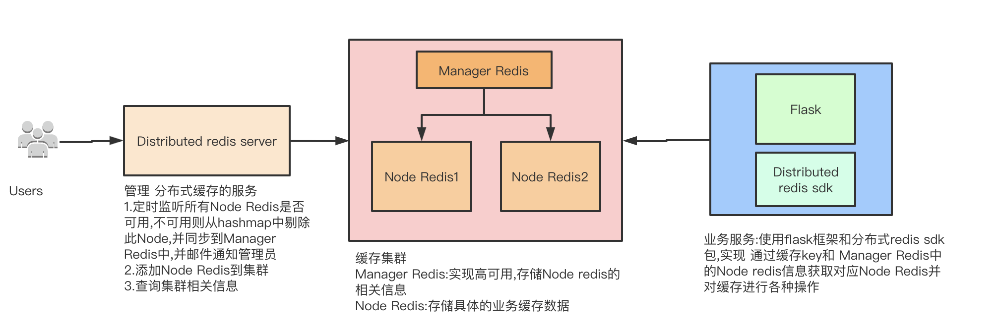

[](https://coveralls.io/github/Rgcsh/distributed_redis_server)
[](https://travis-ci.org/Rgcsh/distributed_redis_server)

***

# 项目描述
* 通过一致性hash 实现python flask版的分布式缓存系统 的服务端

# 项目主要功能
* 定时查询各 redis节点是否有效(使用redis ping命令),无效超过一定时间则从缓存集群中移除此机器,并邮件通知管理员
* 对集群中的 redis节点 通过一致性hash算法 进行add 和 remove
* 通过api接口获取集群 各种统计信息
* 通过api接口实现节点的添加
* 实现一致性hash算法的 虚拟节点功能(尽量平均分配缓存压力)
* 把 集群信息 在经过add,remove后 及时同步到 manager redis中(为了客户端能直接访问redis获取集群信息 对key分配到具体的节点,不用通过此服务,在高并发时只需对 manager redis 进行优化即可),
    集群信息如 虚拟节点对应真实节点的dict:{'23839283':'127.0.0.1',37281723:'127.0.0.2'}

# 系统架构


# 测试
* 所需要的 节点redis 通过项目根目录的 docker-compose.yml 来生成

# 将来要实现功能
* 前端页面 对集群信息进行展示,对节点进行各种操作
* 添加测试用例

# 运行步骤
* 新建虚拟环境,并进入虚拟环境 
    ```
    python3.6 -m venv venv
    ```

* 设置环境变量 FLASK_CONFIG='xxx/distributed_redis_server/config/config_xx.yml'

* 安装相关包
    ```
    pip install -r requirements.txt -i https://pypi.tuna.tsinghua.edu.cn/simple/
    ```

* 运行项目
    ```
    python manage.py start
    ```

# 注意点
* manager redis注意实现高可用功能(主从或哨兵模式)
* 此项目注意 配合 [一致性hash实现python flask版的分布式redis 客户端sdk包](https://github.com/Rgcsh/distributed_redis_sdk.git) 包使用

# 使用技术
* python3.6,flask,APScheduler,yagmail,redis,一致性hash算法 ...

# 代码质量
* pylint
